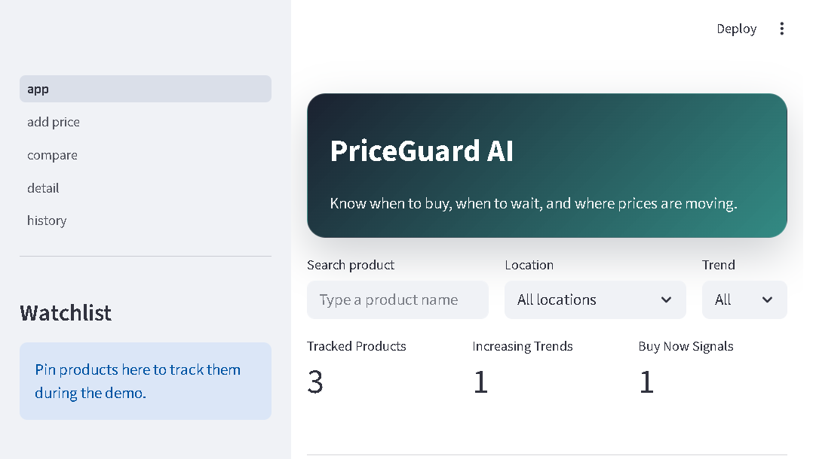

Deployment Link : price-guard-ai.vercel.app

\# PriceGuard-AI

Build a system that tracks product prices, shows price history, and returns a simple recommendation: **buy now** vs **wait**.

This repo is intentionally **contract-first**: we define shared formats first, then each engineer can implement in the tools they prefer.

\## What is fixed (must not change silently)

- API contract: \`docs/api.md\`
- Demo flow: \`docs/demo.md\`
- Contribution rules: \`CONTRIBUTING.md\`

\## Repo structure

- \`Frontend/\` — UI implementation (any stack)
- \`backend/\` — API implementation (any stack)
- \`Ai/\` — prediction/trend implementation (any stack)
- \`docs/\` — contracts and integration notes

\## First team goal

Implement the endpoints in \`docs/api.md\` and make the demo flow in \`docs/demo.md\` pass end-to-end.

## Run locally

1. Set up the environment and seed demo data:

```powershell
.\scripts\setup.ps1
```

2. Start the backend:

```powershell
.\.venv\Scripts\python.exe backend\priceguard\manage.py runserver 8000
```

3. Start the frontend:

```powershell
cd Frontend
npm run dev
```

Frontend app URL (default): `http://127.0.0.1:5173`

Note: The old Streamlit UI is archived in `Frontend_streamlit_legacy/` and is no longer the primary frontend.

## Reset demo data

Use this when you want a clean dataset for the demo:

```powershell
.\scripts\reset-demo.ps1
```

## CI and tests

This repo includes a lightweight GitHub Actions workflow that runs unit tests and the smoke test on push/PR (`.github/workflows/ci.yml`). To run the same checks locally:

1. Activate the virtual environment and install requirements (see `scripts/setup.ps1` for a quick setup).

2. Run Django unit tests:

```powershell
.\.venv\Scripts\python.exe backend\priceguard\manage.py test
```

3. Run the smoke test (exercises list, add-price, history, prediction):

```powershell
.\.venv\Scripts\python.exe scripts\smoke_test.py
```

If CI fails due to CORS or host issues, see `docs/cors.md` for local development tips.

## What makes this different

- Demo-first reliability: one-command setup, reset/seed scripts, and smoke-tested API flow.
- Explainable recommendations: each prediction includes trend, confidence, action, and plain-English reason.
- Practical UX for decisions: dashboard summary, filters, comparison by location, watchlist, and alerts.
- Fast local reproducibility: pinned dependencies and CI checks for backend + smoke paths.

## How the AI recommendation works

The backend prediction endpoint combines recent price history with lightweight logic in `Ai/model.py`.

At a high level:

1. Fetch product history from the backend database.
2. If data is insufficient, return a safe fallback response with a clear reason.
3. If enough data exists, estimate short-term movement and derive:
   - `trend` (`increasing`, `decreasing`, `stable`)
   - `predicted_price`
   - `action` (`buy_now` or `wait`)
   - `confidence`
   - `reason` (plain-English explanation)

This is optimized for interpretability and demo reliability rather than heavy model complexity.

## Troubleshooting

- Backend not reachable from frontend
  - Ensure Django is running on port `8000`.
  - Run: `\.venv\Scripts\python.exe backend\priceguard\manage.py runserver 8000`

- Frontend command not found
  - Ensure Node.js is installed.
  - From `Frontend/`, run `npm install` once, then `npm run dev`.

- CORS or `DisallowedHost` errors
  - Review `docs/cors.md` and add required origins/hosts.

- Empty dashboard data
  - Reset and reseed demo data:
  - `\.\scripts\reset-demo.ps1`

- Prediction unavailable for a product
  - Add more price entries for that product; sparse history returns a safe fallback.

- Verify backend quickly
  - Run unit tests: `\.venv\Scripts\python.exe backend\priceguard\manage.py test`
  - Run smoke test: `\.venv\Scripts\python.exe scripts\smoke_test.py`

## Presenter resources

- One-page demo guide: `docs/demo-script.md`
- Architecture overview: `docs/architecture.md`

## UI preview


