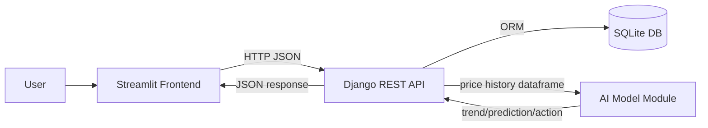

# Architecture

PriceGuard-AI is split by responsibility, but integrates through stable API contracts.

## Simple architecture diagram

## Components

- Frontend
  - Renders dashboard, history, detail, compare, and add-price screens.
  - Calls backend endpoints defined in `docs/api.md`.

- Backend API
  - Validates and stores incoming prices.
  - Serves latest prices, history, and prediction endpoints.
  - Orchestrates prediction logic and returns consistent JSON payloads.

- AI / Prediction
  - Consumes product price history.
  - Returns `{ trend, predicted_price, action, confidence, reason }`.

## Data flow

1. User adds or views price data in Streamlit.
2. Frontend calls Django API endpoints under `/api`.
3. Backend reads/writes data via Django ORM and SQLite.
4. Backend calls the AI model for prediction endpoints.
5. API returns trend and recommendation fields to frontend cards/pages.

## Reliability and operations

- Idempotent seeding: `backend/priceguard/load_seed.py`
- API unit tests: `backend/priceguard/api/tests.py`
- End-to-end smoke test: `scripts/smoke_test.py`
- CI checks on push/PR: `.github/workflows/ci.yml`

## Contracts and boundaries

- Frontend is contract-first and depends only on API response fields.
- Backend business logic is centralized in `api/services.py`.
- AI integration is kept lightweight for demo reliability and explainability.
